# 🚀 Production-Grade Node.js CI/CD Deployment & Monitoring on AWS EKS

<div align="center">
  
  
  
  
  
  
  
</div>

<br />

Welcome to **Masar Job Board** (`masar-job-board`)—a premium, production-grade Vite & React web application fully containerized, continuously analyzed for quality and security, and deployed to a highly available, auto-scaling **Amazon Web Services (AWS) Elastic Kubernetes Service (EKS)** cluster.

This repository demonstrates a complete, automated industry-standard DevSecOps pipeline leveraging **GitLab CI/CD**, multi-stage **Docker** builds, **SonarQube** static application security testing (SAST), and GitOps-oriented deployment using the **GitLab Kubernetes Agent**.

---

## 🗺️ Architectural Workflow

Here is the high-fidelity cloud infrastructure and DevSecOps pipeline architecture diagram of the project:

<div align="center">
  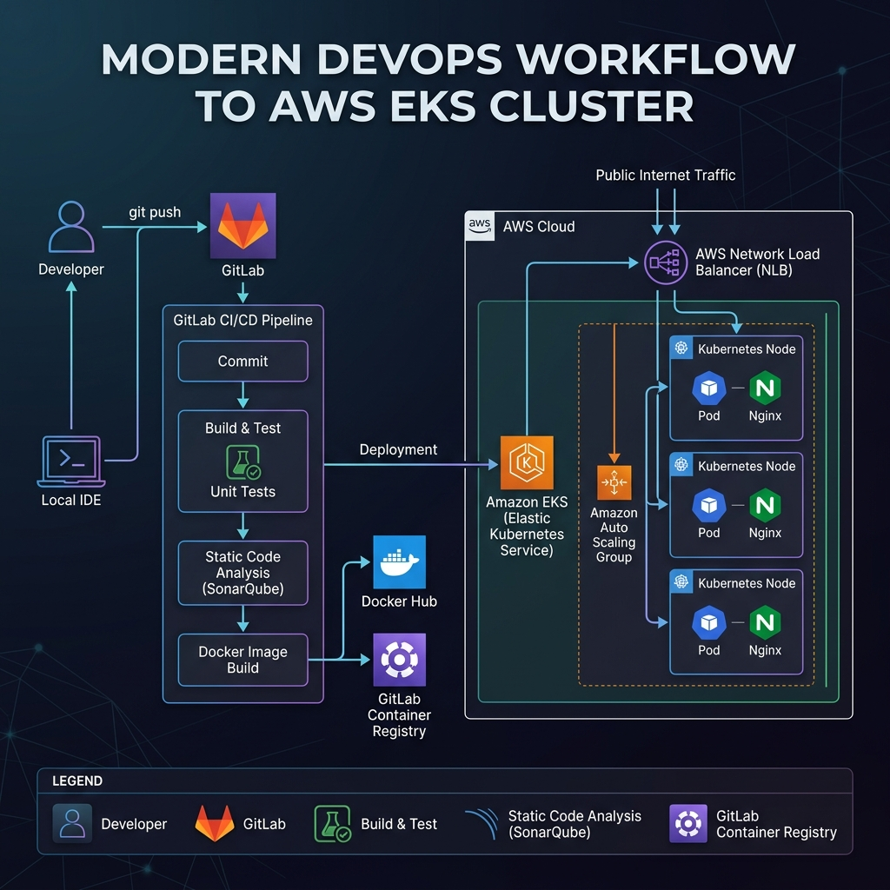
</div>

<br />

The automated journey from code push to a live application running on AWS EKS is represented below:

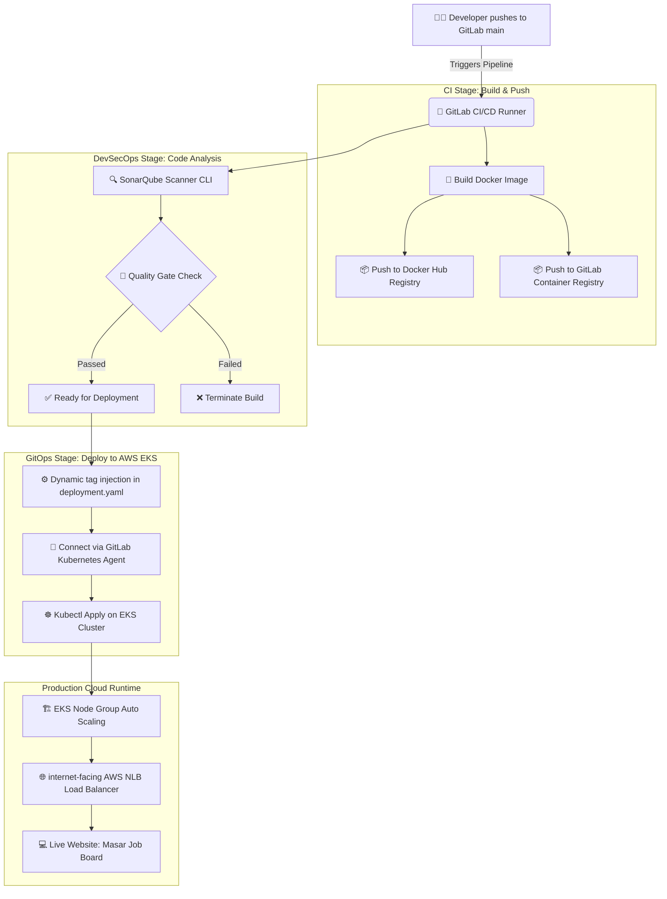
```mermaid
graph TD
    A[🧑‍💻 Developer pushes to GitLab main] -->|Triggers Pipeline| B(🦊 GitLab CI/CD Runner)
    
    subgraph CI Stage: Build & Push
        B --> C[🐳 Build Docker Image]
        C --> D1[📦 Push to Docker Hub Registry]
        C --> D2[📦 Push to GitLab Container Registry]
    end
    
    subgraph DevSecOps Stage: Code Analysis
        B --> E[🔍 SonarQube Scanner CLI]
        E --> F{🚦 Quality Gate Check}
        F -->|Passed| G[✅ Ready for Deployment]
        F -->|Failed| H[❌ Terminate Build]
    end
    
    subgraph GitOps Stage: Deploy to AWS EKS
        G --> I[⚙️ Dynamic tag injection in deployment.yaml]
        I --> J[🔌 Connect via GitLab Kubernetes Agent]
        J --> K[☸️ Kubectl Apply on EKS Cluster]
    end
    
    subgraph Production Cloud Runtime
        K --> L[🏗️ EKS Node Group Auto Scaling]
        L --> M[🌐 internet-facing AWS NLB Load Balancer]
        M --> N[💻 Live Website: Masar Job Board]
    end
```

---

## 🛠️ Project Core Configurations

### 1. Multi-Stage Containerization (`Dockerfile`)
We utilize a secure, small-footprint **multi-stage build** to compile the React application and serve it under a high-performance **Nginx** server:
*   **Build Stage**: Leverages `node:22-alpine` to install dependencies and run a programmatic Vite build (`build.js`), minimizing download overhead.
*   **Production Stage**: Uses a lightweight `nginx:alpine` image, copies the static production build (`dist/`) into Nginx's HTML directory, injects custom server configuration, and exposes Port 80.

### 2. Custom Server Routing (`nginx.conf`)
Ensures single-page application (SPA) client-side routing behaves correctly under Nginx:
```nginx
server {
  listen 80;
  server_name localhost;
  root /usr/share/nginx/html;
  index index.html;

  location / {
    try_files $uri $uri/ /index.html;
  }
}
```

### 3. GitLab CI/CD Pipeline (`.gitlab-ci.yml`)
Consists of four automated, containerized stages:
1.  **Build & Push (Docker Hub)**: Builds the container and registers it with the public Docker Hub registry.
2.  **Build & Push (GitLab)**: Builds the container and registers it with the private GitLab Container Registry.
3.  **SonarQube QA**: Runs the `sonar-scanner-cli` to perform static code analysis and upload reports to our SonarQube server.
4.  **EKS Deployment**: Dynamically replaces `IMAGE_PLACEHOLDER` with the fresh image tag inside `deployment.yaml`, selects the Kubernetes context using the GitLab Agent token, and runs `kubectl apply`.

### 4. Kubernetes Orchestration (`deployment.yaml` & `service.yaml`)
*   **Deployment Specs**: Spins up **3 replicas** of the container, maps resources limits (CPU: `500m`, Memory: `512Mi`) to guarantee quality of service, and uses `gitlab-registry-secret` to pull the private image.
*   **Service Specs**: Configures an **internet-facing AWS Network Load Balancer (NLB)** that routes public HTTP traffic (Port 80) securely down to the pod endpoints.

---

## 📸 Step-by-Step Deployment Journey (Visual Walkthrough)

Here is the step-by-step visual implementation of our cloud-native infrastructure, testing suites, pipelines, and running live project.

---

### 📡 Phase 1: AWS EKS Infrastructure Provisioning

> [!NOTE]
> Establishing a highly available, resilient Amazon EKS cluster handles the Kubernetes Control Plane, while Managed Node Groups provide the server capacity.

#### 1. EKS Cluster Creation Setup
We initiate EKS Cluster creation to provision a secure, managed control plane across multiple Availability Zones.

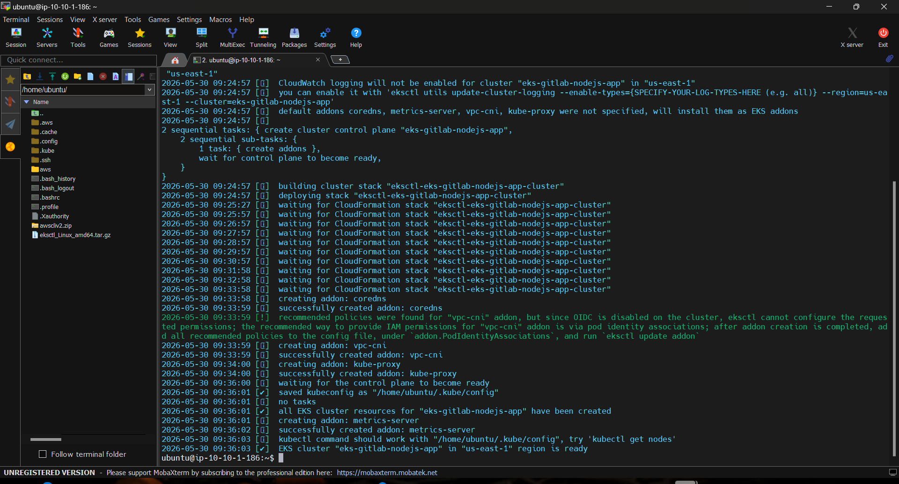
*Figure 1: EKS Cluster initialization progress on the AWS Management Console.*

---

#### 2. EKS Cluster Active Control Plane
The AWS EKS control plane is successfully configured, active, and ready to accept Kubernetes commands.

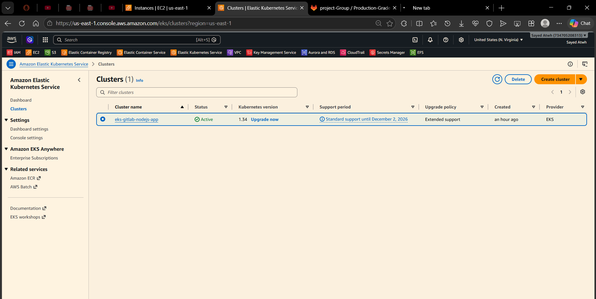
*Figure 2: Active EKS Cluster details on AWS.*

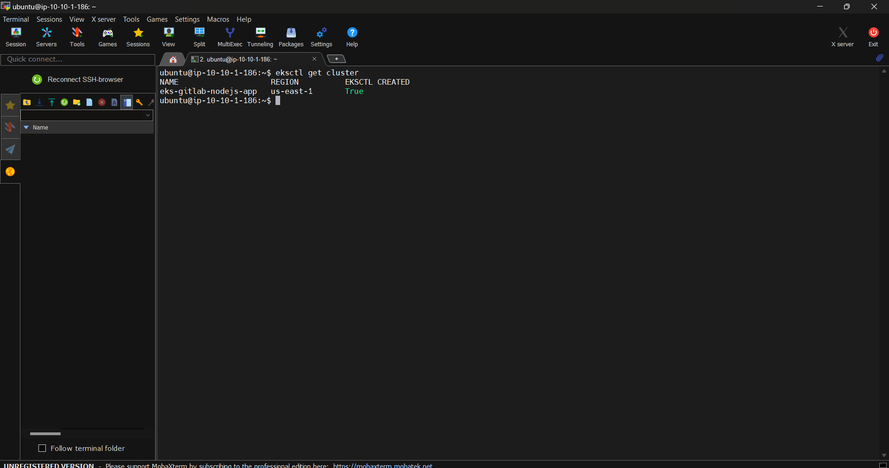
*Figure 3: High-level overview of EKS settings and Kubernetes version.*

---

#### 3. Managed Worker Node Group Creation
To run our application pods, we configure a Managed Node Group specifying the instance types, IAM Roles, and disk configurations.

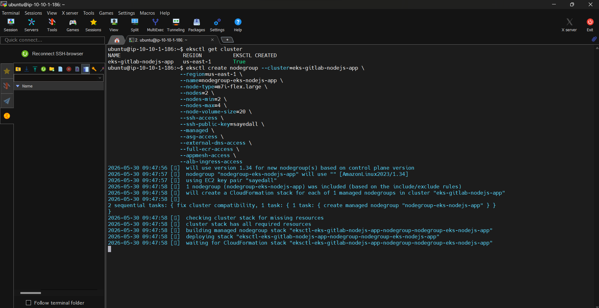
*Figure 4: Configuring EKS Worker Node parameters.*

---

#### 4. Active Node Group & Auto Scaling
Once provisioned, EKS automatically links our nodes to the cluster, ensuring native communication between the control plane and pods.

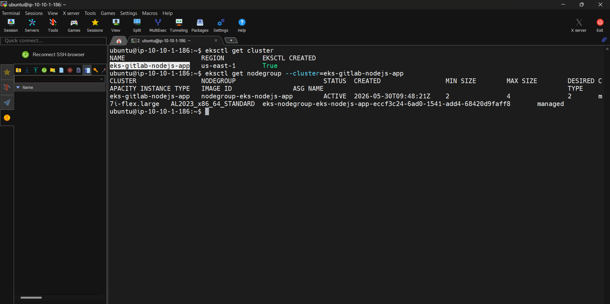
*Figure 5: Node group status showing active nodes in the subnet.*

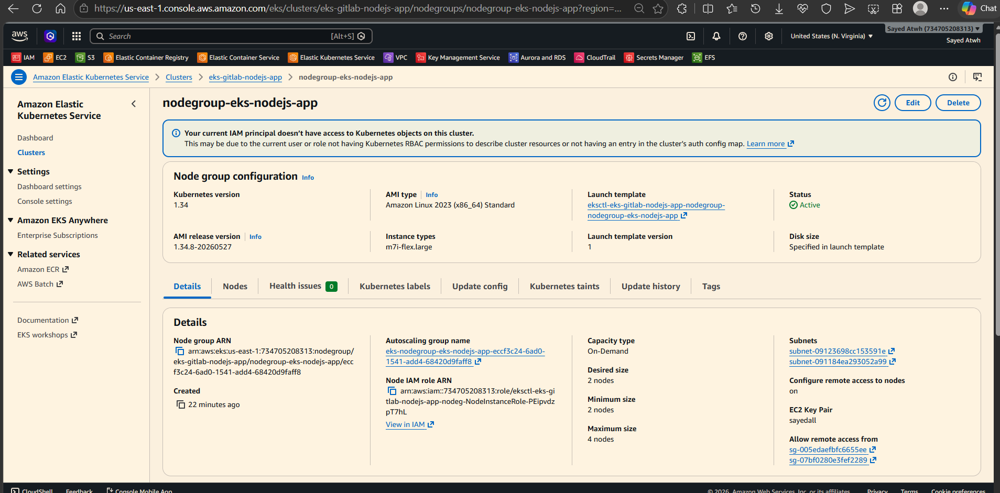
*Figure 6: EKS Managed Node Group operational status overview.*

---

#### 5. Provisioned EC2 Instances & Scaling Groups
AWS EKS automatically spins up EC2 instances inside an Auto Scaling Group to match our scaling policies.

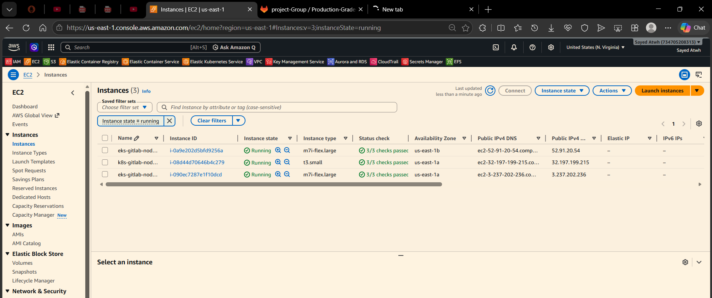
*Figure 7: Running EC2 worker node instances in our AWS VPC.*

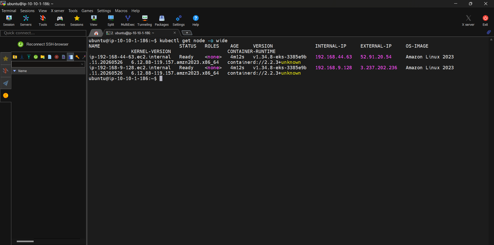
*Figure 8: Node registration verification.*

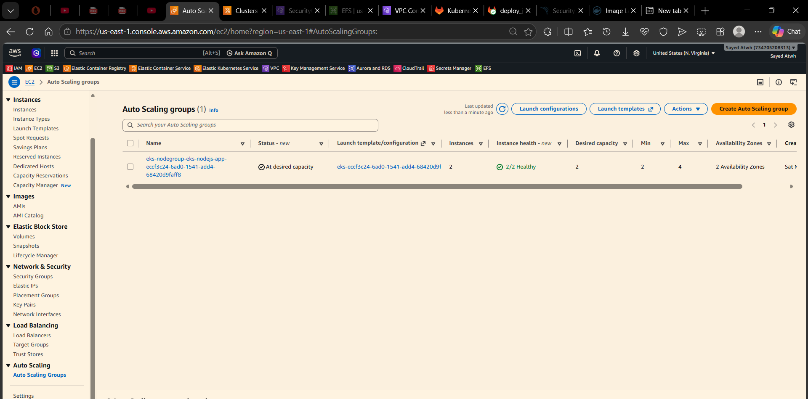
*Figure 9: Auto Scaling Group monitoring and scaling bounds.*

---

### 🛡️ Phase 2: DevSecOps & Pipeline Setup

> [!TIP]
> Integrating automated security scans and cloud agents inside our CI/CD pipeline guarantees secure deployments with zero manual keys exposed.

#### 6. SonarQube Code Quality Server
We spin up a dedicated SonarQube instance to inspect code quality, duplicate lines, test coverage, and vulnerabilities.

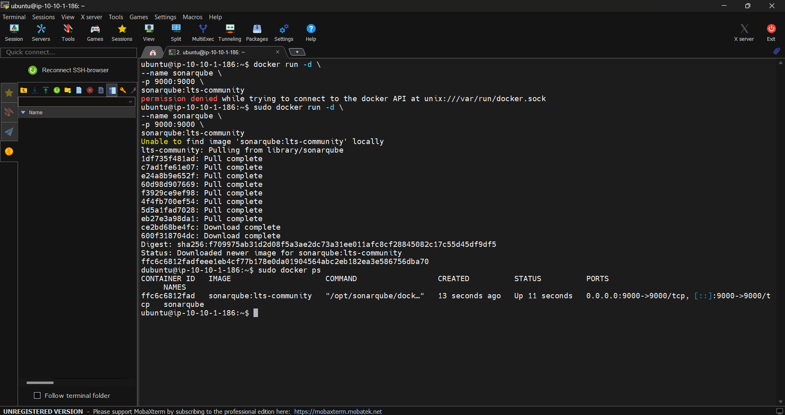
*Figure 10: Setting up the SonarQube instance dashboard.*

---

#### 7. SonarQube API Key Generation
A secure integration token is generated to allow the GitLab runner to push analysis reports programmatically.

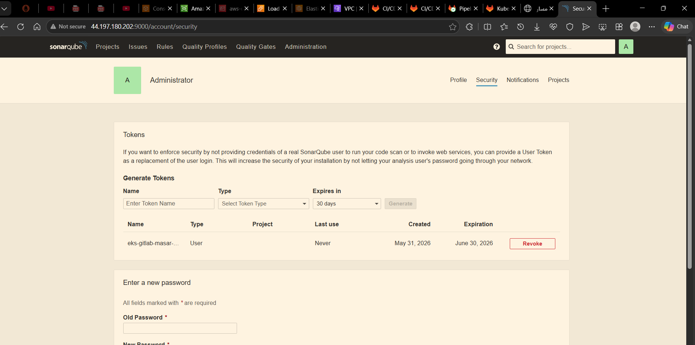
*Figure 11: Generating a unique token for the GitLab scanner CLI.*

---

#### 8. Secure CI/CD Environment Variables
Sensitive data like registry credentials, host URLs, tokens, and cluster connections are stored securely inside GitLab CI/CD Variables.

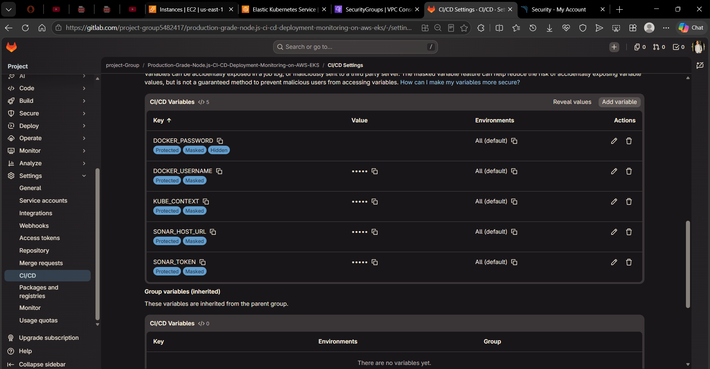
*Figure 12: Private credentials mapped safely as GitLab environment variables.*

---

#### 9. Connecting EKS via GitLab Kubernetes Agent
Rather than exposing highly privileged AWS credentials to our runner, we install the secure **GitLab Kubernetes Agent** directly inside EKS to manage git-to-cluster synchronizations safely.

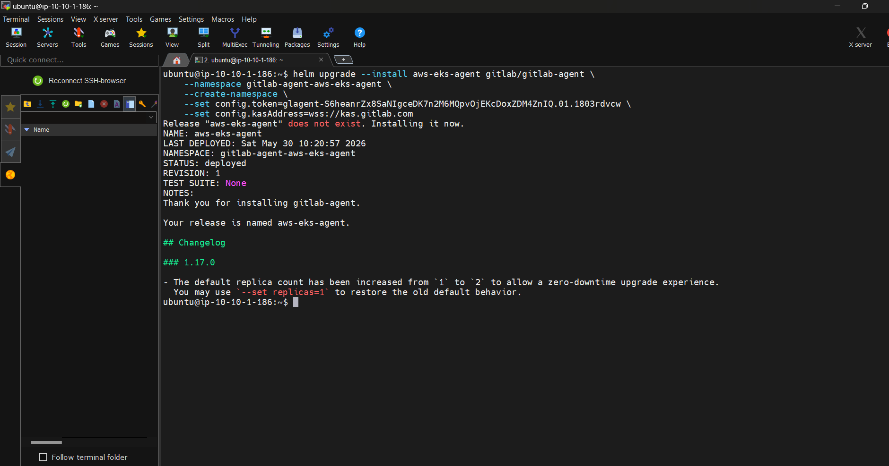
*Figure 13: Generating registration scripts for the Kubernetes Agent.*

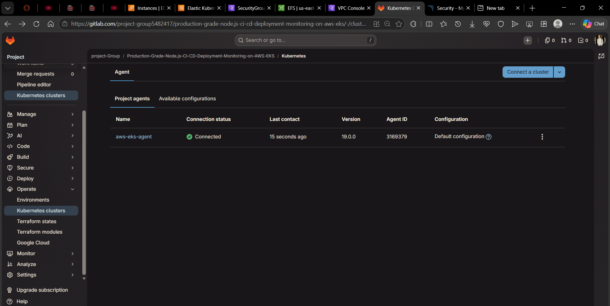
*Figure 14: GitLab Kubernetes Agent showing a connected status and active synchronization.*

---

### 🚀 Phase 3: GitLab CI/CD Pipeline Execution

> [!IMPORTANT]
> The automated pipeline build runs on every commit to `main`, packaging our code, running static scans, and updating our registry images.

#### 10. GitLab CI/CD Pipeline Run
A complete visual representation of our 4-stage pipeline passing successfully with parallel container building, SonarQube test execution, and dynamic deployment.

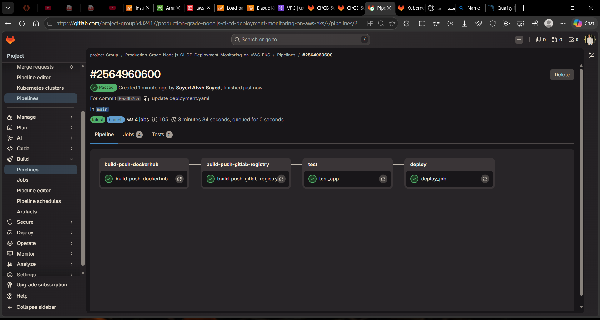
*Figure 15: Executed pipeline view showing all green stages.*

---

#### 11. Docker Hub Container Registry Pushed Image
The built container image is tagged with the pipeline ID and pushed successfully to the Docker Hub public registry.

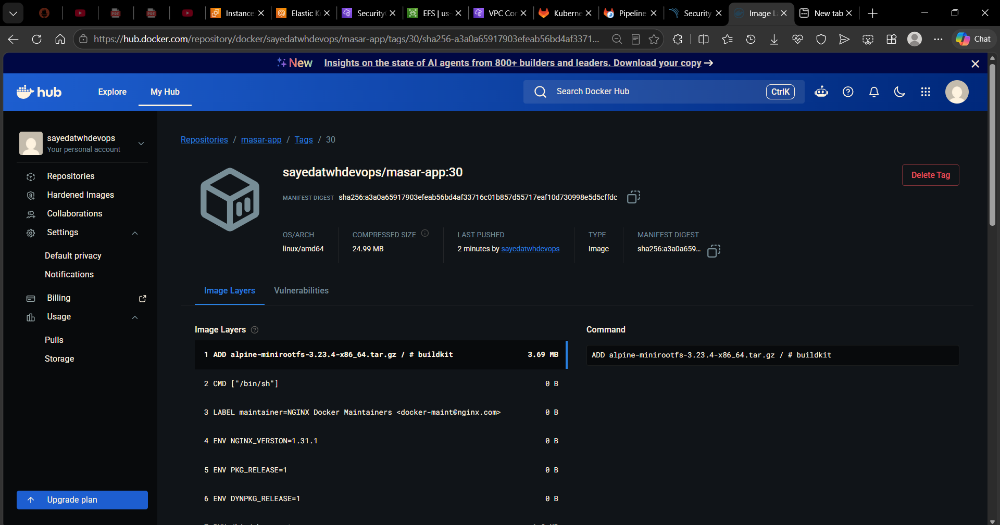
*Figure 16: Pushed container registry record on Docker Hub.*

---

#### 12. GitLab Private Container Registry Pushed Image
In parallel, the container image is securely pushed into GitLab's built-in private Container Registry.

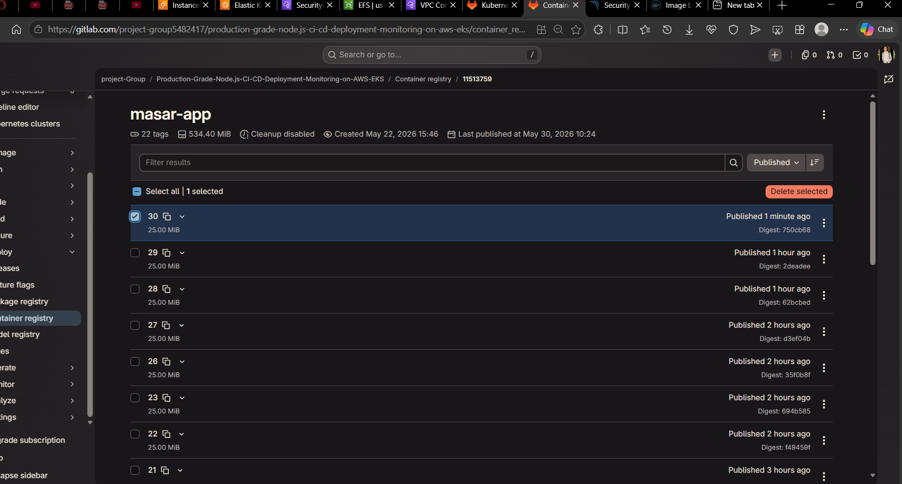
*Figure 17: Pushed container registry record on GitLab.*

---

#### 13. SonarQube Static Code Analysis Results
SonarQube scans the code, validates syntax, search logs, and gives our application a clean **Passed Quality Gate** status.

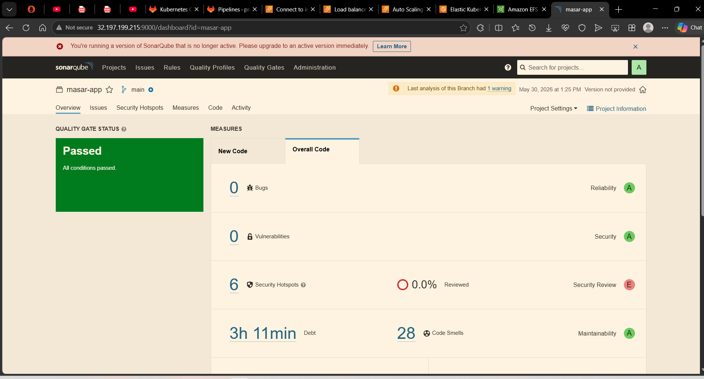
*Figure 18: SonarQube dashboard reporting zero bugs, vulnerabilities, or code smells.*

---

### 🌐 Phase 4: AWS EKS Deployment & Live Application

> [!TIP]
> After deployment, Kubernetes resources are scaled across multiple worker nodes, and exposed globally via an AWS Network Load Balancer (NLB).

#### 14. Active Kubernetes Resources (kubectl get all)
A diagnostic printout verifying that 3 separate application Pods are running, the Service LoadBalancer is active, and the ReplicaSet is healthy.

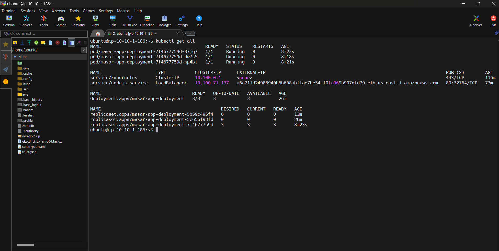
*Figure 19: Output of 'kubectl get all -o wide' inside the EKS cluster.*

---

#### 15. AWS Network Load Balancer (NLB) Active Status
AWS successfully provisions a public-facing Network Load Balancer (NLB) that maps incoming user traffic directly to our pods.

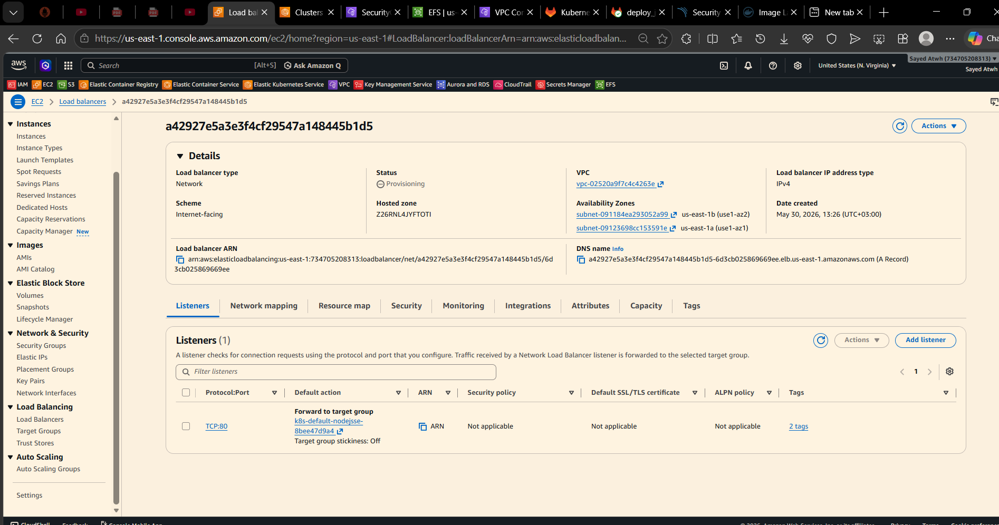
*Figure 20: Provisioned AWS Load Balancer with public DNS name.*

---

#### 16. Live Website: Masar Job Board
The ultimate proof of concept: **Masar Job Board** is fully responsive and live globally, served by our multi-pod EKS cluster!

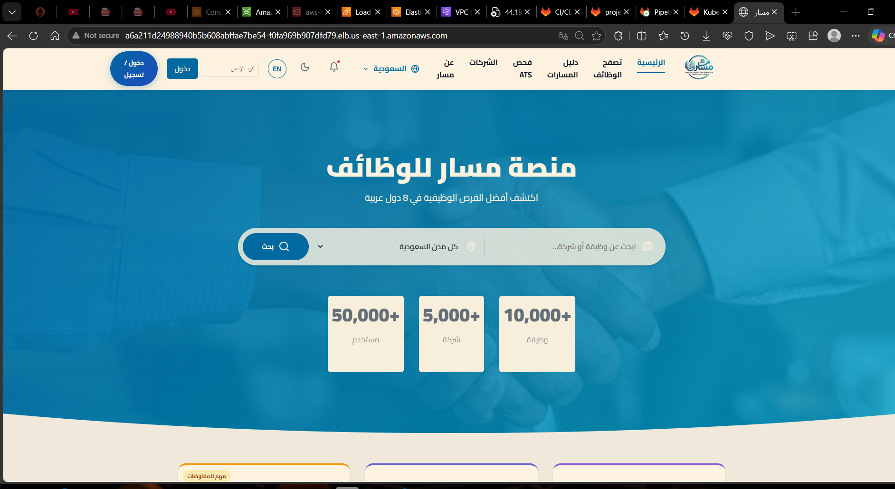
*Figure 21: Deployed Vite + React app live and fully functional on the public internet.*

---

## ⚙️ How to Deploy & Run Locally

### 1. Running Locally
Ensure you have Node.js installed, then run:
```bash
# Clone the repository
git clone https://gitlab.com/your-username/masar-app.git
cd masar-app

# Install dependencies
npm install

# Start Vite developer server
npm run dev
```

### 2. Running in Docker Container
Build and run the production image locally using:
```bash
# Build the image
docker build -t masar-app .

# Run the container mapping Port 80 to Port 3000 locally
docker run -d -p 3000:80 masar-app
```

### 3. Deploying to AWS EKS
1. Set up your EKS Cluster and Node Groups on AWS.
2. Register the GitLab Agent to get your KUBE_CONTEXT.
3. Configure GitLab CI/CD Variables (`DOCKER_USERNAME`, `DOCKER_PASSWORD`, `SONAR_TOKEN`, `SONAR_HOST_URL`, `KUBE_CONTEXT`).
4. Commit your changes and push to `main` to trigger the automatic pipeline.

---

<div align="center">
  <p>💡 Built with precision, automated with passion, and deployed at scale on AWS Cloud.</p>
</div>